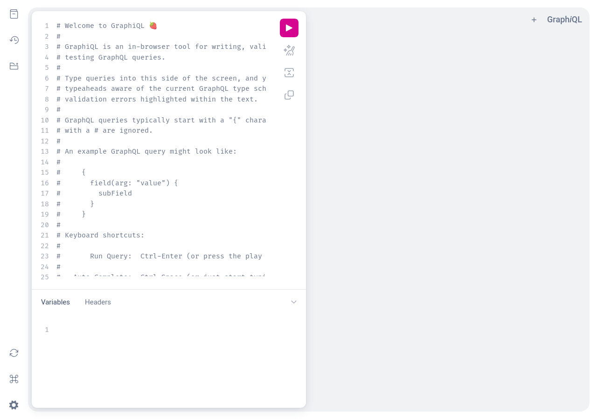

# GraphQL Blog API


**GraphQL blog with JWT auth, posts, comments, and interactive playground.**

| | |
|---|---|
|  |  |

## Features

- GraphQL API — queries + mutations for posts, comments, users
- JWT auth — register, login, token-based
- Blog CRUD — create, update, delete posts
- Comments — add to posts (auth required)
- GraphQL Playground — interactive IDE at `/graphql`
- SQLite — zero-config persistence

## Tech Stack

| Layer | Tech |
|---|---|
| Backend | Python 3.12, FastAPI, SQLAlchemy |
| GraphQL | Strawberry GraphQL |
| Auth | JWT (python-jose), SHA-256 |
| Testing | pytest, httpx |

## Quick Start

```bash
git clone https://github.com/voicenotesite/graphql-blog.git
cd graphql-blog
python3 -m venv venv
source venv/bin/activate
pip install -r requirements.txt
uvicorn app.main:app --host 0.0.0.0 --port 8000 --reload
```

Open [http://localhost:8000/graphql](http://localhost:8000/graphql)

## Example Queries

### Register / Login

```graphql
mutation {
  register(input: { email: "user@example.com", username: "alice", password: "secret123" }) {
    accessToken
    user { id email username }
  }
}
```

### Create Post (send JWT in `Authorization: Bearer <token>`)

```graphql
mutation {
  createPost(input: { title: "Hello World", content: "First post!", published: true }) {
    id title content published author { username }
  }
}
```

### Get All Posts

```graphql
query {
  posts { id title content author { username } comments { content author { username } } }
}
```

### Add Comment

```graphql
mutation {
  addComment(input: { postId: "POST_ID", content: "Nice post!" }) {
    id content author { username }
  }
}
```

## Testing

```bash
python -m pytest tests/ -v
```

## License

MIT
